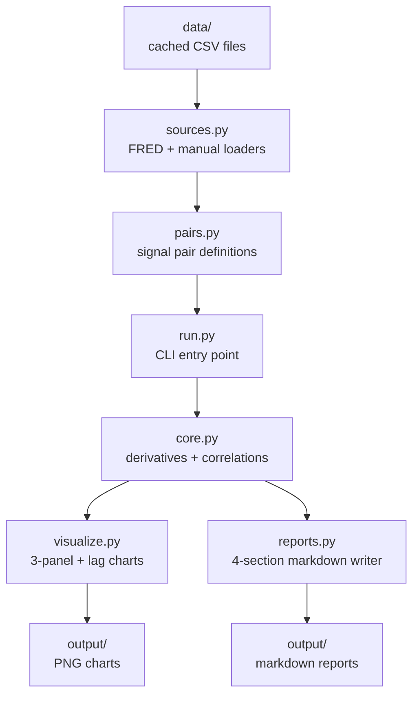

# signal_tool

A reusable framework for backtesting leading-indicator hypotheses on any pair of time series.

## What it does

Given a defined pair of signals (a *leading* and an *outcome*), `signal_tool` runs the full 4-section analysis:

1. **Section 1 — Data collection.** Loads both series from cached CSV (or fetches from FRED). Documents source URLs and units.
2. **Section 2 — Data processing.** Aligns the series on a common time axis. Computes 1st derivative (YoY %) and 2nd derivative (change in YoY %).
3. **Section 3 — Pre-analysis visualization.** Produces a 3-panel chart showing level, 1st derivative, and 2nd derivative side by side. *Always runs before correlation analysis.*
4. **Section 4 — Correlation analysis.** Computes lag correlation across a configurable range. Identifies the peak and interprets it relative to the hypothesized lead time.

Output for each pair: two PNG charts and one markdown report in `output/`.

## Quick start

### One-time install

```bash
cd signal_tool
pip install -r requirements.txt
```

### Option A — interactive web app (recommended)

```bash
streamlit run app.py
```

Opens in your browser at `http://localhost:8501`. Includes:
- Sidebar pair selector + metadata
- **Overview**: hypothesis, headline metrics, color-coded verdict banner
- **Data tab**: source URLs, aligned dataset with CSV download
- **Pre-Analysis tab**: interactive 3-panel chart (level, 1st, 2nd derivative). Toggle 2nd derivative on/off, hover any line for exact values.
- **Correlation tab**: lag correlation chart with adjustable max-lag slider, sortable table with color-coded r values
- **Compare tab**: all pairs side by side + overlay of all lag-correlation curves on one axis

### Option B — CLI

```bash
python run.py --list                       # see available pairs
python run.py copper_transformer           # run one pair
python run.py                              # run all pairs
```

Generates static PNG charts and markdown reports in `output/`.

## Project structure

```
signal_tool/
├── __init__.py        Package exports and run_pair() / run_all()
├── core.py            Signal, SignalPair dataclasses + analysis functions
├── sources.py         Data loaders (FRED CSV, manual annual CSV)
├── visualize.py       Static matplotlib chart generation (for CLI)
├── reports.py         4-section markdown report writer (for CLI)
├── pairs.py           PAIRS registry — defines all signal pairs to test
├── run.py             CLI entry point
├── app.py             Streamlit interactive web app
├── requirements.txt   Python dependencies
├── data/              Cached CSV input data
└── output/            Generated CLI charts and reports
```

## Adding a new signal pair

1. Add CSV data to `data/`. Format: `DATE,VALUE` for monthly or `YEAR,VALUE` for annual.
2. Define a `Signal` for each variable in `pairs.py`:

```python
my_signal = Signal(
    name="my_signal",
    description="Brief description of what this measures",
    source_url="https://...",
    units="...",
    loader=load_fred_monthly,         # or load_annual
    loader_args=("my_signal",),       # the CSV filename stem
)
```

3. Define a `SignalPair` and add to the `PAIRS` dict:

```python
PAIRS["my_pair_name"] = SignalPair(
    name="my_pair_name",
    leading=my_signal,
    outcome=transformer_ppi,
    hypothesis="My signal leads transformer PPI by N months because...",
    expected_lead_low=3,
    expected_lead_high=9,
    frequency="monthly",
)
```

4. Run it: `python run.py my_pair_name`

## Current pairs

| Pair | Leading → Outcome | Frequency | Expected lead |
|---|---|---|---|
| `copper_transformer` | Copper PPI → Transformer PPI | Monthly | 6-12 months |
| `hyperscaler_transformer` | Hyperscaler capex → Transformer PPI | Annual | 1-2 years |

## Methodology

Follows a 4-section structure: data collection → processing → pre-analysis visualization → correlation. The two core principles:

1. **"First, raw data. Second, correlation."** Build trust by documenting where data comes from before drawing any conclusions from it.
2. **Plot the raw series before any statistical analysis.** Visual inspection often reveals patterns (or refutes hypotheses) that correlation alone would miss.

The tool enforces this order in code — Section 3 visualization always runs before Section 4 correlation, and the markdown report writer always documents collection and processing before analysis.

## Architecture



## What's deferred to v2

- ML-based prediction (intentionally deferred — focus is on data collection + visualization first)
- Web UI (Streamlit / Dash) — current output is static PNG + markdown
- Automated data refresh from APIs (currently CSVs are populated by manual web_fetch)
- Multi-pair cross-correlation matrices
- Statistical significance testing
