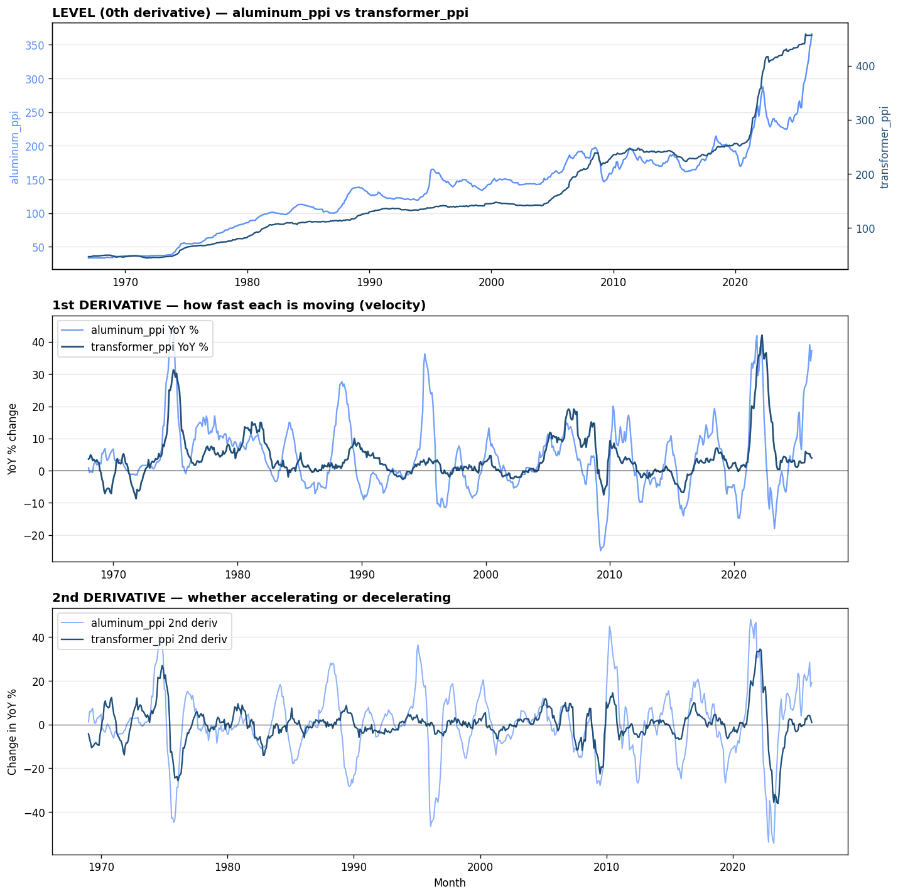
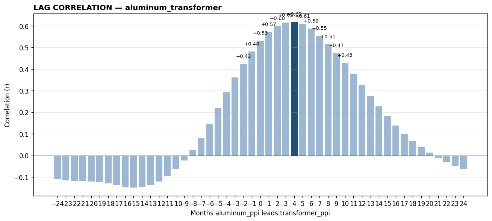

# aluminum_transformer — backtest report

*Generated by `signal_tool` on 2026-05-28*

**Hypothesis:** Aluminum prices lead transformer PPI by 6-12 months — aluminum is used in transformer windings and housings alongside copper

**Headline result:** Peak correlation r = +0.618 at lag = +4 months
(aluminum_ppi leading transformer_ppi by 4 months, n=696)

---

## Section 1 — Data Collection

### Leading signal: `aluminum_ppi`
- Description: PPI by Commodity: Metals and Metal Products: Aluminum Mill Shapes
- Source: https://fred.stlouisfed.org/series/WPU102501
- Units: Index 1982=100, Not Seasonally Adjusted

### Outcome signal: `transformer_ppi`
- Description: PPI by Industry: Electric Power and Specialty Transformer Manufacturing
- Source: https://fred.stlouisfed.org/series/PCU335311335311
- Units: Index Jun 1981=100, Not Seasonally Adjusted

### Aligned dataset
- Frequency: monthly
- Range: 1967-01-01 to 2026-04-01
- Observations: 712

First 10 rows of aligned (leading, outcome) data:

| DATE                |    x |    y |   x_d1 |   y_d1 |
|:--------------------|-----:|-----:|-------:|-------:|
| 1967-01-01 00:00:00 | 33.1 | 46.9 |    nan |    nan |
| 1967-02-01 00:00:00 | 33.6 | 47   |    nan |    nan |
| 1967-03-01 00:00:00 | 33.6 | 46.9 |    nan |    nan |
| 1967-04-01 00:00:00 | 33.6 | 47   |    nan |    nan |
| 1967-05-01 00:00:00 | 33.6 | 47.9 |    nan |    nan |
| 1967-06-01 00:00:00 | 33.6 | 48   |    nan |    nan |
| 1967-07-01 00:00:00 | 33.6 | 48.1 |    nan |    nan |
| 1967-08-01 00:00:00 | 33.6 | 48.3 |    nan |    nan |
| 1967-09-01 00:00:00 | 33.6 | 48.1 |    nan |    nan |
| 1967-10-01 00:00:00 | 33.5 | 48.2 |    nan |    nan |

---

## Section 2 — Data Processing

Transformations applied:
- **1st derivative (YoY %)**: `(value[t] / value[t-12 months] - 1) * 100`. Why: normalizes both series to growth rates, comparable across different units and scales.
- **2nd derivative (Δ YoY %)**: `yoy[t] - yoy[t-12 months]`. Why: reveals whether each series is *accelerating* or *decelerating* — often the cleanest place to spot inflection points.

---

## Section 3 — Pre-analysis Visualization

**What's visible by eye:**
- Top panel: levels of both series over time
- Middle panel: 1st derivative (YoY %) — visible peaks and troughs in growth
- Bottom panel: 2nd derivative — synchronized inflection points or divergences

*Expected lead from hypothesis: 6–12 months.*

---

## Section 4 — Correlation Analysis

### Correlation at each lag

| Lag (months) | r | n |
|---|---|---|
| -24 | -0.109 | 676 |
| -23 | -0.114 | 677 |
| -22 | -0.117 | 678 |
| -21 | -0.118 | 679 |
| -20 | -0.121 | 680 |
| -19 | -0.124 | 681 |
| -18 | -0.130 | 682 |
| -17 | -0.138 | 683 |
| -16 | -0.146 | 684 |
| -15 | -0.149 | 685 |
| -14 | -0.146 | 686 |
| -13 | -0.138 | 687 |
| -12 | -0.121 | 688 |
| -11 | -0.095 | 689 |
| -10 | -0.062 | 690 |
| -9 | -0.022 | 691 |
| -8 | +0.025 | 692 |
| -7 | +0.081 | 693 |
| -6 | +0.147 | 694 |
| -5 | +0.221 | 695 |
| -4 | +0.294 | 696 |
| -3 | +0.361 | 697 |
| -2 | +0.423 | 698 |
| -1 | +0.481 | 699 |
| +0 | +0.530 | 700 |
| +1 | +0.570 | 699 |
| +2 | +0.598 | 698 |
| +3 | +0.615 | 697 |
| +4 ⭐ | +0.618 | 696 |
| +5 | +0.609 | 695 |
| +6 | +0.587 | 694 |
| +7 | +0.553 | 693 |
| +8 | +0.514 | 692 |
| +9 | +0.473 | 691 |
| +10 | +0.429 | 690 |
| +11 | +0.379 | 689 |
| +12 | +0.327 | 688 |
| +13 | +0.276 | 687 |
| +14 | +0.228 | 686 |
| +15 | +0.182 | 685 |
| +16 | +0.138 | 684 |
| +17 | +0.100 | 683 |
| +18 | +0.068 | 682 |
| +19 | +0.039 | 681 |
| +20 | +0.013 | 680 |
| +21 | -0.011 | 679 |
| +22 | -0.032 | 678 |
| +23 | -0.049 | 677 |
| +24 | -0.061 | 676 |

### Interpretation

**Hypothesis PARTIALLY supported.** Moderate correlation in predicted direction; lead time may differ from hypothesis.

Peak correlation: r = +0.618 at lag = +4 months (n=696).
