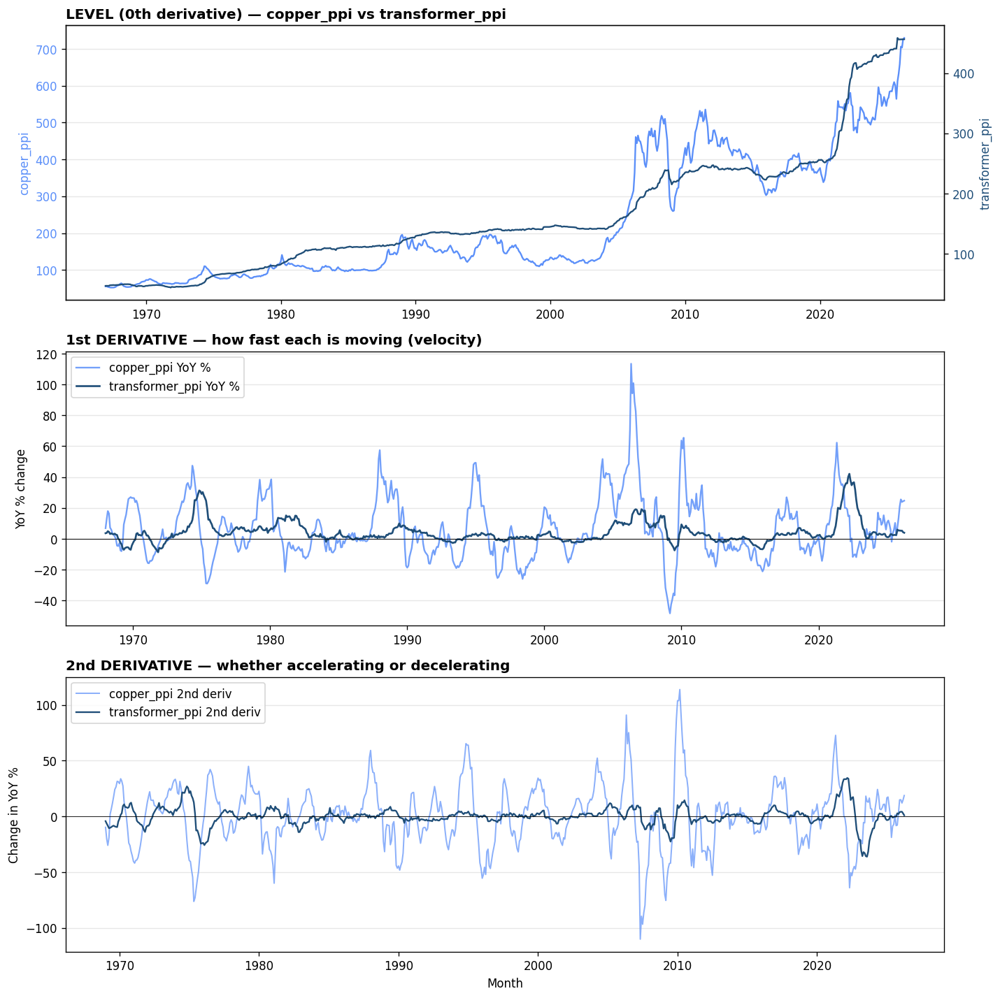
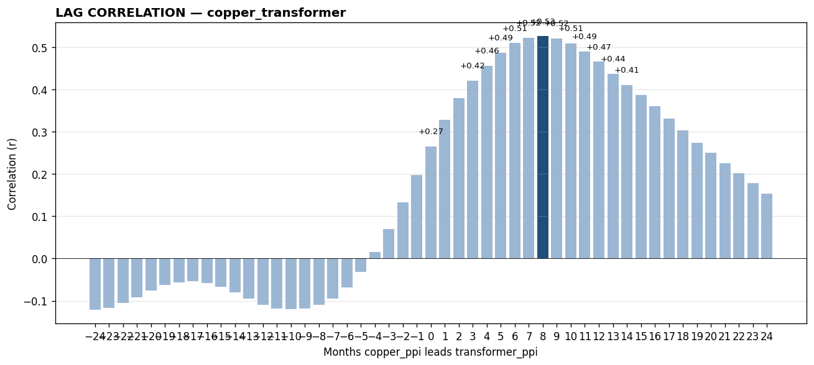

# copper_transformer — backtest report

*Generated by `signal_tool` on 2026-05-28*

**Hypothesis:** Copper price changes lead transformer PPI by 6-12 months as copper is the primary metal input to transformer windings

**Headline result:** Peak correlation r = +0.526 at lag = +8 months
(copper_ppi leading transformer_ppi by 8 months, n=692)

---

## Section 1 — Data Collection

### Leading signal: `copper_ppi`
- Description: PPI by Commodity: Special Indexes: Copper and Copper Products
- Source: https://fred.stlouisfed.org/series/WPUSI019011
- Units: Index 1982=100, Not Seasonally Adjusted

### Outcome signal: `transformer_ppi`
- Description: PPI by Industry: Electric Power and Specialty Transformer Manufacturing
- Source: https://fred.stlouisfed.org/series/PCU335311335311
- Units: Index Jun 1981=100, Not Seasonally Adjusted

### Aligned dataset
- Frequency: monthly
- Range: 1967-01-01 to 2026-04-01
- Observations: 712

First 10 rows of aligned (leading, outcome) data:

| DATE                |    x |    y |   x_d1 |   y_d1 |
|:--------------------|-----:|-----:|-------:|-------:|
| 1967-01-01 00:00:00 | 55.2 | 46.9 |    nan |    nan |
| 1967-02-01 00:00:00 | 55.2 | 47   |    nan |    nan |
| 1967-03-01 00:00:00 | 54   | 46.9 |    nan |    nan |
| 1967-04-01 00:00:00 | 53.1 | 47   |    nan |    nan |
| 1967-05-01 00:00:00 | 52.4 | 47.9 |    nan |    nan |
| 1967-06-01 00:00:00 | 52.1 | 48   |    nan |    nan |
| 1967-07-01 00:00:00 | 52.1 | 48.1 |    nan |    nan |
| 1967-08-01 00:00:00 | 52.1 | 48.3 |    nan |    nan |
| 1967-09-01 00:00:00 | 52.7 | 48.1 |    nan |    nan |
| 1967-10-01 00:00:00 | 53.8 | 48.2 |    nan |    nan |

---

## Section 2 — Data Processing

Transformations applied:
- **1st derivative (YoY %)**: `(value[t] / value[t-12 months] - 1) * 100`. Why: normalizes both series to growth rates, comparable across different units and scales.
- **2nd derivative (Δ YoY %)**: `yoy[t] - yoy[t-12 months]`. Why: reveals whether each series is *accelerating* or *decelerating* — often the cleanest place to spot inflection points.

---

## Section 3 — Pre-analysis Visualization

**What's visible by eye:**
- Top panel: levels of both series over time
- Middle panel: 1st derivative (YoY %) — visible peaks and troughs in growth
- Bottom panel: 2nd derivative — synchronized inflection points or divergences

*Expected lead from hypothesis: 6–12 months.*

---

## Section 4 — Correlation Analysis

### Correlation at each lag

| Lag (months) | r | n |
|---|---|---|
| -24 | -0.122 | 676 |
| -23 | -0.116 | 677 |
| -22 | -0.105 | 678 |
| -21 | -0.091 | 679 |
| -20 | -0.076 | 680 |
| -19 | -0.063 | 681 |
| -18 | -0.056 | 682 |
| -17 | -0.054 | 683 |
| -16 | -0.058 | 684 |
| -15 | -0.066 | 685 |
| -14 | -0.080 | 686 |
| -13 | -0.095 | 687 |
| -12 | -0.110 | 688 |
| -11 | -0.118 | 689 |
| -10 | -0.120 | 690 |
| -9 | -0.118 | 691 |
| -8 | -0.110 | 692 |
| -7 | -0.095 | 693 |
| -6 | -0.068 | 694 |
| -5 | -0.032 | 695 |
| -4 | +0.015 | 696 |
| -3 | +0.070 | 697 |
| -2 | +0.132 | 698 |
| -1 | +0.197 | 699 |
| +0 | +0.265 | 700 |
| +1 | +0.328 | 699 |
| +2 | +0.380 | 698 |
| +3 | +0.421 | 697 |
| +4 | +0.456 | 696 |
| +5 | +0.487 | 695 |
| +6 | +0.509 | 694 |
| +7 | +0.522 | 693 |
| +8 ⭐ | +0.526 | 692 |
| +9 | +0.521 | 691 |
| +10 | +0.509 | 690 |
| +11 | +0.490 | 689 |
| +12 | +0.465 | 688 |
| +13 | +0.436 | 687 |
| +14 | +0.410 | 686 |
| +15 | +0.387 | 685 |
| +16 | +0.360 | 684 |
| +17 | +0.330 | 683 |
| +18 | +0.303 | 682 |
| +19 | +0.274 | 681 |
| +20 | +0.250 | 680 |
| +21 | +0.226 | 679 |
| +22 | +0.202 | 678 |
| +23 | +0.178 | 677 |
| +24 | +0.154 | 676 |

### Interpretation

**Hypothesis CONFIRMED.** Strong positive correlation in predicted direction and within expected lead range.

Peak correlation: r = +0.526 at lag = +8 months (n=692).
