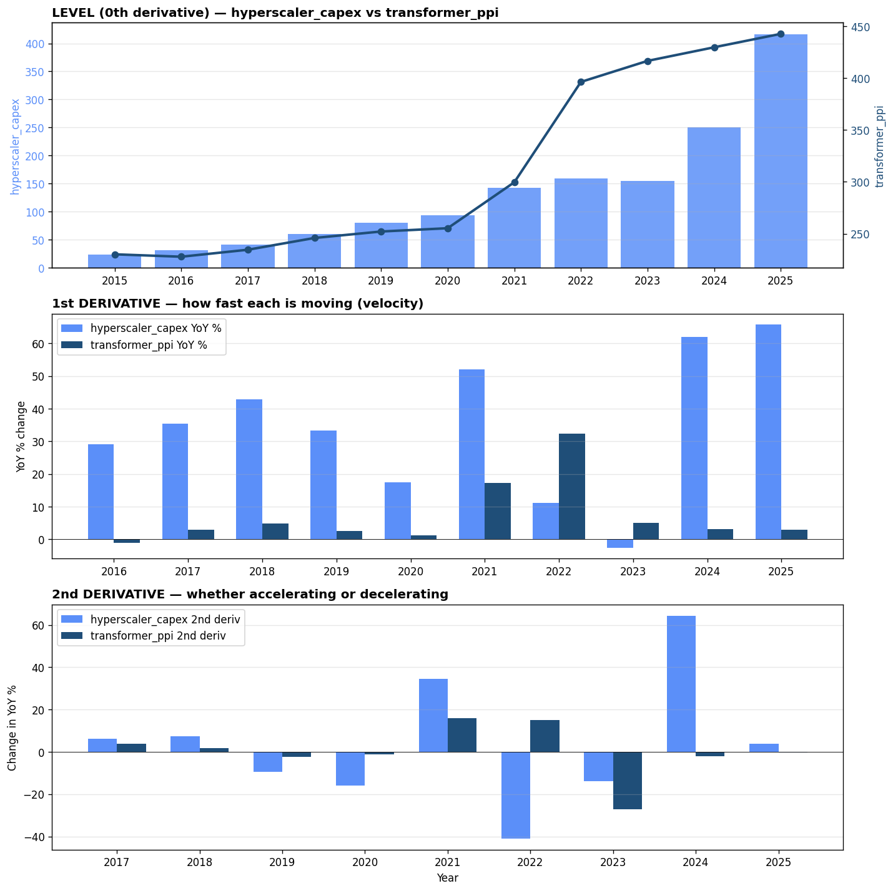
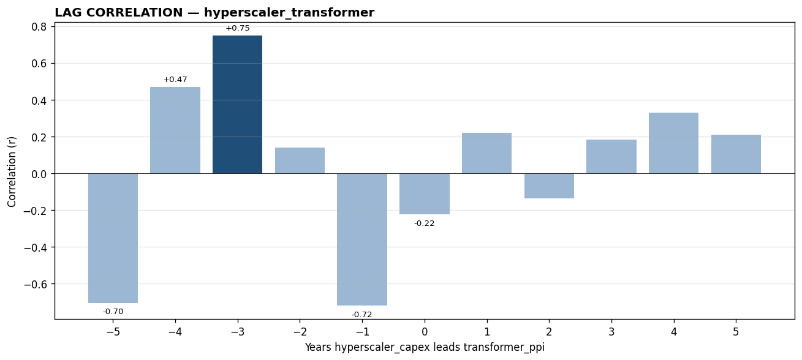

# hyperscaler_transformer — backtest report

*Generated by `signal_tool` on 2026-05-28*

**Hypothesis:** Hyperscaler capex (data center buildout) leads transformer PPI by 1-2 years as AI demand drives grid equipment demand

**Headline result:** Peak correlation r = +0.748 at lag = -3 years
(hyperscaler_capex lagging transformer_ppi by 3 years, n=7)

---

## Section 1 — Data Collection

### Leading signal: `hyperscaler_capex`
- Description: Combined annual capex for Amazon + Google + Meta + Microsoft
- Source: https://platformonomics.com/2026/02/follow-the-capex-2025-retrospective/
- Units: USD billions, calendar year

### Outcome signal: `transformer_ppi`
- Description: PPI by Industry: Electric Power and Specialty Transformer Manufacturing
- Source: https://fred.stlouisfed.org/series/PCU335311335311
- Units: Index Jun 1981=100, Not Seasonally Adjusted

### Aligned dataset
- Frequency: annual
- Range: 2015-12-31 to 2025-12-31
- Observations: 11

First 10 rows of aligned (leading, outcome) data:

| DATE                |   x |      y |   x_d1 |   y_d1 |
|:--------------------|----:|-------:|-------:|-------:|
| 2015-12-31 00:00:00 |  24 | 230.18 | nan    | nan    |
| 2016-12-31 00:00:00 |  31 | 227.84 |  29.17 |  -1.02 |
| 2017-12-31 00:00:00 |  42 | 234.58 |  35.48 |   2.96 |
| 2018-12-31 00:00:00 |  60 | 245.93 |  42.86 |   4.84 |
| 2019-12-31 00:00:00 |  80 | 252.15 |  33.33 |   2.53 |
| 2020-12-31 00:00:00 |  94 | 255.32 |  17.5  |   1.26 |
| 2021-12-31 00:00:00 | 143 | 299.6  |  52.13 |  17.34 |
| 2022-12-31 00:00:00 | 159 | 396.35 |  11.19 |  32.29 |
| 2023-12-31 00:00:00 | 155 | 416.62 |  -2.52 |   5.12 |
| 2024-12-31 00:00:00 | 251 | 429.74 |  61.94 |   3.15 |

---

## Section 2 — Data Processing

Transformations applied:
- **1st derivative (YoY %)**: `(value[t] / value[t-1 year] - 1) * 100`. Why: normalizes both series to growth rates, comparable across different units and scales.
- **2nd derivative (Δ YoY %)**: `yoy[t] - yoy[t-1 year]`. Why: reveals whether each series is *accelerating* or *decelerating* — often the cleanest place to spot inflection points.

---

## Section 3 — Pre-analysis Visualization

**What's visible by eye:**
- Top panel: levels of both series over time
- Middle panel: 1st derivative (YoY %) — visible peaks and troughs in growth
- Bottom panel: 2nd derivative — synchronized inflection points or divergences

*Expected lead from hypothesis: 1–2 years.*

---

## Section 4 — Correlation Analysis

### Correlation at each lag

| Lag (years) | r | n |
|---|---|---|
| -5 | -0.705 | 5 |
| -4 | +0.468 | 6 |
| -3 ⭐ | +0.748 | 7 |
| -2 | +0.141 | 8 |
| -1 | -0.720 | 9 |
| +0 | -0.223 | 10 |
| +1 | +0.221 | 9 |
| +2 | -0.136 | 8 |
| +3 | +0.181 | 7 |
| +4 | +0.330 | 6 |
| +5 | +0.210 | 5 |

### Interpretation

**Hypothesis REJECTED — direction reversed.** The outcome variable appears to lead the proposed leading signal, not the other way around.

Peak correlation: r = +0.748 at lag = -3 years (n=7).
