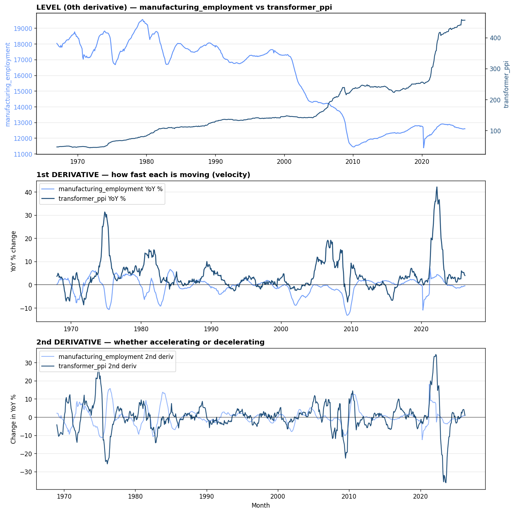
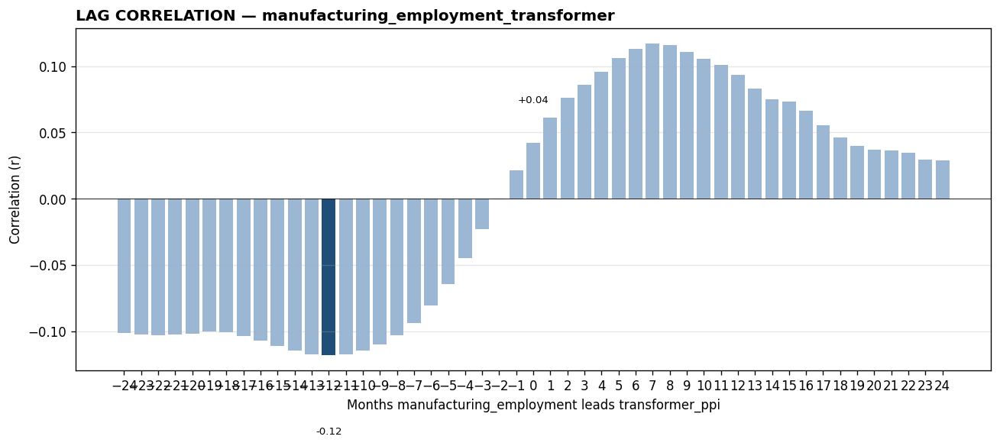

# manufacturing_employment_transformer — backtest report

*Generated by `signal_tool` on 2026-05-28*

**Hypothesis:** US manufacturing employment leads transformer PPI by 3-9 months — labor market reflects industrial activity which drives equipment demand

**Headline result:** Peak correlation r = -0.118 at lag = -12 months
(manufacturing_employment lagging transformer_ppi by 12 months, n=688)

---

## Section 1 — Data Collection

### Leading signal: `manufacturing_employment`
- Description: All Employees, Manufacturing (BLS Current Employment Statistics)
- Source: https://fred.stlouisfed.org/series/MANEMP
- Units: Thousands of Persons, Seasonally Adjusted

### Outcome signal: `transformer_ppi`
- Description: PPI by Industry: Electric Power and Specialty Transformer Manufacturing
- Source: https://fred.stlouisfed.org/series/PCU335311335311
- Units: Index Jun 1981=100, Not Seasonally Adjusted

### Aligned dataset
- Frequency: monthly
- Range: 1967-01-01 to 2026-04-01
- Observations: 712

First 10 rows of aligned (leading, outcome) data:

| DATE                |     x |    y |   x_d1 |   y_d1 |
|:--------------------|------:|-----:|-------:|-------:|
| 1967-01-01 00:00:00 | 18033 | 46.9 |    nan |    nan |
| 1967-02-01 00:00:00 | 17978 | 47   |    nan |    nan |
| 1967-03-01 00:00:00 | 17940 | 46.9 |    nan |    nan |
| 1967-04-01 00:00:00 | 17878 | 47   |    nan |    nan |
| 1967-05-01 00:00:00 | 17832 | 47.9 |    nan |    nan |
| 1967-06-01 00:00:00 | 17812 | 48   |    nan |    nan |
| 1967-07-01 00:00:00 | 17784 | 48.1 |    nan |    nan |
| 1967-08-01 00:00:00 | 17905 | 48.3 |    nan |    nan |
| 1967-09-01 00:00:00 | 17794 | 48.1 |    nan |    nan |
| 1967-10-01 00:00:00 | 17800 | 48.2 |    nan |    nan |

---

## Section 2 — Data Processing

Transformations applied:
- **1st derivative (YoY %)**: `(value[t] / value[t-12 months] - 1) * 100`. Why: normalizes both series to growth rates, comparable across different units and scales.
- **2nd derivative (Δ YoY %)**: `yoy[t] - yoy[t-12 months]`. Why: reveals whether each series is *accelerating* or *decelerating* — often the cleanest place to spot inflection points.

---

## Section 3 — Pre-analysis Visualization

**What's visible by eye:**
- Top panel: levels of both series over time
- Middle panel: 1st derivative (YoY %) — visible peaks and troughs in growth
- Bottom panel: 2nd derivative — synchronized inflection points or divergences

*Expected lead from hypothesis: 3–9 months.*

---

## Section 4 — Correlation Analysis

### Correlation at each lag

| Lag (months) | r | n |
|---|---|---|
| -24 | -0.101 | 676 |
| -23 | -0.102 | 677 |
| -22 | -0.103 | 678 |
| -21 | -0.103 | 679 |
| -20 | -0.102 | 680 |
| -19 | -0.100 | 681 |
| -18 | -0.101 | 682 |
| -17 | -0.104 | 683 |
| -16 | -0.107 | 684 |
| -15 | -0.111 | 685 |
| -14 | -0.114 | 686 |
| -13 | -0.117 | 687 |
| -12 ⭐ | -0.118 | 688 |
| -11 | -0.117 | 689 |
| -10 | -0.114 | 690 |
| -9 | -0.110 | 691 |
| -8 | -0.103 | 692 |
| -7 | -0.094 | 693 |
| -6 | -0.081 | 694 |
| -5 | -0.064 | 695 |
| -4 | -0.045 | 696 |
| -3 | -0.023 | 697 |
| -2 | -0.001 | 698 |
| -1 | +0.022 | 699 |
| +0 | +0.042 | 700 |
| +1 | +0.061 | 699 |
| +2 | +0.076 | 698 |
| +3 | +0.086 | 697 |
| +4 | +0.096 | 696 |
| +5 | +0.106 | 695 |
| +6 | +0.113 | 694 |
| +7 | +0.117 | 693 |
| +8 | +0.116 | 692 |
| +9 | +0.111 | 691 |
| +10 | +0.106 | 690 |
| +11 | +0.101 | 689 |
| +12 | +0.093 | 688 |
| +13 | +0.083 | 687 |
| +14 | +0.075 | 686 |
| +15 | +0.073 | 685 |
| +16 | +0.067 | 684 |
| +17 | +0.056 | 683 |
| +18 | +0.046 | 682 |
| +19 | +0.040 | 681 |
| +20 | +0.037 | 680 |
| +21 | +0.036 | 679 |
| +22 | +0.034 | 678 |
| +23 | +0.029 | 677 |
| +24 | +0.029 | 676 |

### Interpretation

**Hypothesis REJECTED.** Correlation too weak to support a leading-indicator relationship at any tested lag.

Peak correlation: r = -0.118 at lag = -12 months (n=688).
